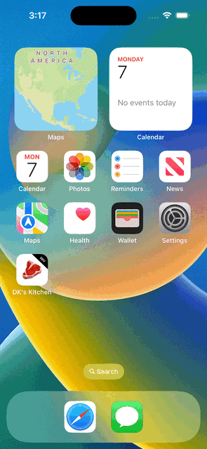
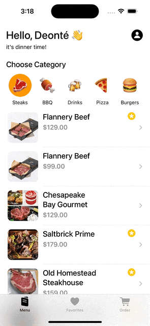

# DK's Kitchen

# About the app

## An app aimed for restaurant owners to manage their customers with minimum contact, when customer’s seated at a restaurant table.

### Features will include:
- The app shows a menu as a list.
- Menu list is fetched from an API and saved in the app.
- Users can choose menu items and add them to their order.
- Upon checkout, total amount will be calculated.
- Users can add items to their favorites list to order them quickly.

## Screens

